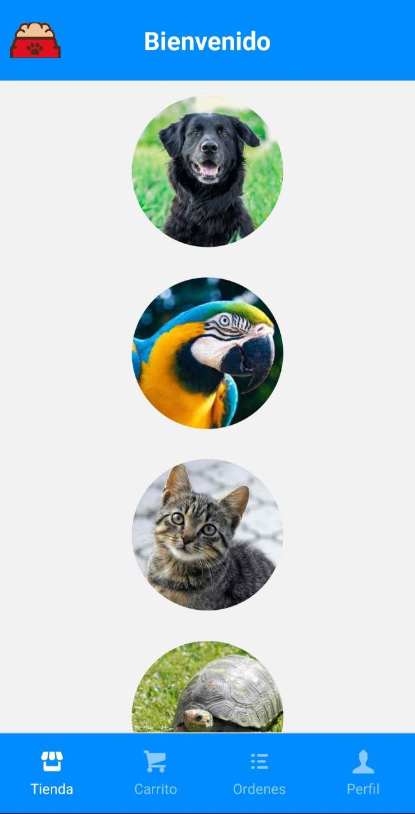
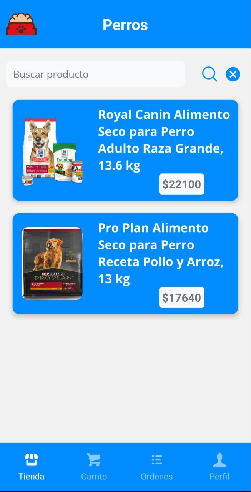
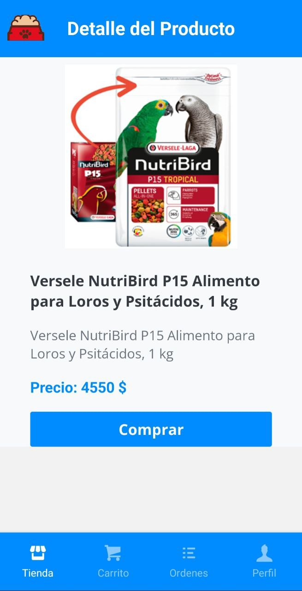
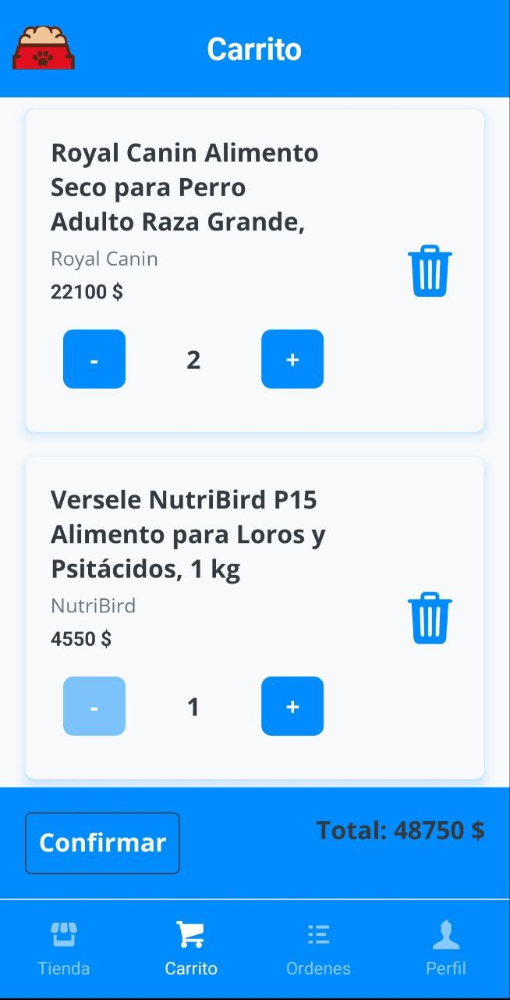
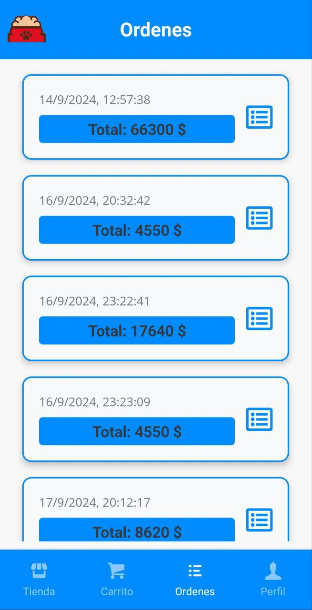
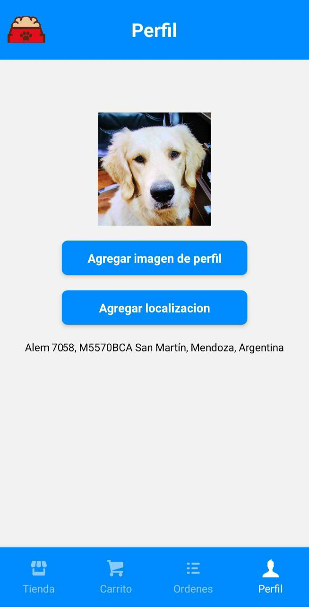

<h1> Proyecto final curso "Desarrollo de aplicaciones" - Coderhouse </h1>
<br>
<p align="center"></p>
<h2 align="center">Rocco - Alimentos para mascotas </h2>

## Aplicación ecommerce de venta de alimento para mascotas desarrollada con React Native.

## 🖥️ Profesor: Maximiliano Rosanda

## 🖥️ Tutor Regular: Rocío Martin

## 🖥️ Tutor Adjunto: Cristian Farias

## Capturas de la app

### Pantalla Home - Categorias



### Pantalla Productos



## Pantalla Detalle de producto



## Pantalla Carrito de compras



## Pantalla Ordenes de compra



## Pantalla Perfil




## Tecnologías Utilizadas

- **Firebase Authentication:** Implementa el sistema de autenticación de Firebase para gestionar la seguridad de la aplicación.
- **React Native Navigation Stack:** Gestiona la navegación entre pantallas.
- **React Native Navigation Buttom tap:** Gestiona la navegación entre pestañas.
- **AsyncStorage:** Permite guardar la sesion para no hacer login en cada reinicio de la app.
- **Expo-Location:** Permite acceder y gestionar la ubicación del usuario.
- **Expo-Picker-Image:** Facilita la carga de imágenes de perfil.
- **Redux:** Centraliza y gestiona el estado de la aplicación.
- **RTK Query y Firebase:** Realiza operaciones de lectura/escritura en la base de datos.

## Correr localmente

Clonar el proyecto

```bash
  git clone https://github.com/FernandoCabrera06/proyecto_final_Aplicaciones_Coderhouse.git
```

Cambiar de directorio

```bash
  proyecto_final_Aplicaciones_Coderhouse
```

Instalar dependencias

```bash
  npm install
```

Iniciar proyecto

```bash
  npm run start
```
